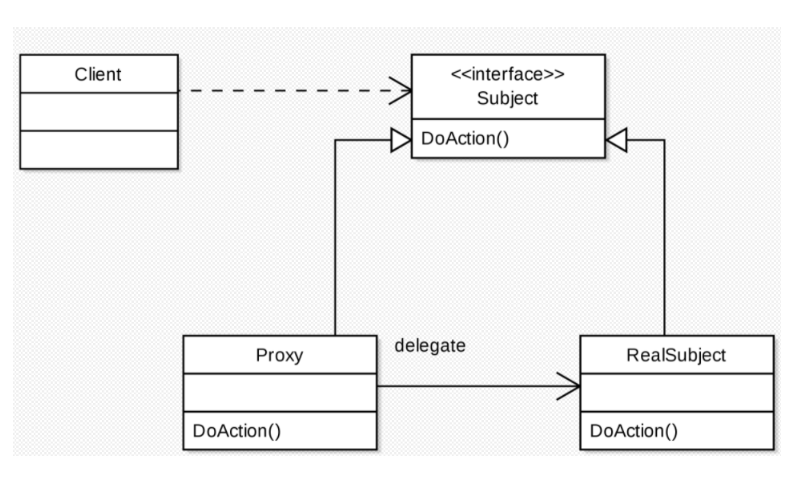

# 프록시 패턴(Proxy Pattern)
### 프록시는 변역하면 대리자,대변인의 의미를 갖고 있다. 
### 어떤 객체를 사용하고자 할때, 객체를 직접적으로 참조하는 것이 아닌 해당 객체를 대항하는 객체를 통해 대상 객체에 접근하는 방식을 사용하면 해당 객체가 메모리에 존재하지 않아도 기본적인 정보를 참조하거나 설정할 수 있고, 실제 객체의 기능이 필요한 시점까지 객체의 생성을 미룰 수 있다.

## 장점
- ### 사이즈가 큰 객체가 로딩되기 전에도 프록시를 통해 참조할 수 있다.
* ### 실제 객체의 pubilc,protected 메소드를 숨기도 인터페이스를 통해 노출시킬 수 있다.
+ ### 로컬에 있지 않고 떨어져있는 객체를 사용할 수 있다.
+ ### 원래 객체에 접근에 대해 사전처리를 할 수 있다.

## 단점
- ### 객체를 생성할 때 한 단계를 거치게 되므로, 빈번한 객체 생성이 필요한 경우 성능이 저하될 수 있다.
* ### 프록시 내부에서 객체 생성을 위해 스레드가 생성, 동기화가 구현되어야 하는 경우 성능이 저하될 수 있다.
+ ### 로직이 낳해해져 가독성이 떨어질 수 있다.

## [출처](https://velog.io/@newtownboy/%EB%94%94%EC%9E%90%EC%9D%B8%ED%8C%A8%ED%84%B4-%ED%94%84%EB%A1%9D%EC%8B%9C%ED%8C%A8%ED%84%B4Proxy-Pattern)
